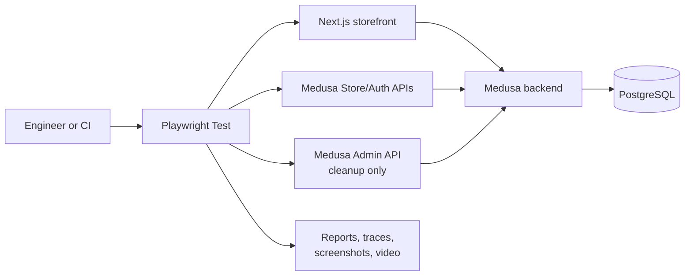
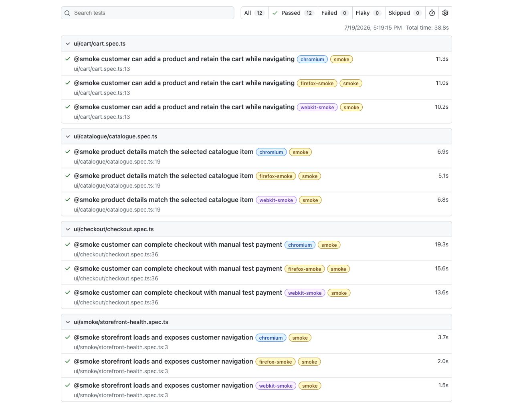

# Northstar Commerce Quality Platform

A portfolio-grade Playwright and TypeScript solution for a local Medusa commerce application. It combines browser journeys, typed Store API coverage, API-assisted test setup, isolated data, deterministic cleanup, cross-browser smoke testing, and CI evidence.

## What this project demonstrates

- Business-readable coverage of catalogue, variants, cart, authentication, and checkout.
- 19 Chromium regression tests, with four critical scenarios also exercised in Firefox and WebKit.
- Parallel-safe carts and customers created through typed API helpers.
- Automatic deletion of synthetic customers, even after a failed test.
- Fresh PostgreSQL data and ephemeral Medusa keys in CI.
- HTML reports, screenshots, traces, logs, and an opt-in video workflow.

## Architecture



See the [architecture guide](docs/architecture.md) for the automation layers, data lifecycle, and execution matrix.

## Repository layout

```text
northstar-commerce-quality/
├── automation/
│   ├── tests/             # UI and API specifications
│   ├── pages/             # Page objects
│   ├── components/        # Reusable UI components
│   ├── fixtures/          # Test setup, browser state, and teardown
│   ├── api/               # Typed Medusa clients and contracts
│   ├── factories/         # Unique customers and prepared carts
│   ├── config/            # Environment configuration
│   ├── playwright-report/ # Latest HTML report
│   └── test-results/      # Run artifacts
├── docs/                  # Architecture and portfolio documentation
├── my-medusa-store/       # Local application under test
└── playwright.config.ts   # Runner and browser configuration
```

`automation/` is the quality solution. `my-medusa-store/` is the colocated system under test, included to make the project reproducible.

## Quick start

Prerequisites: Node.js 20 or newer and a local PostgreSQL instance available to Medusa.

```bash
# Install automation and application dependencies
npm install
npm --prefix my-medusa-store install

# Install all browsers used by the smoke matrix
npx playwright install chromium firefox webkit

# Create local automation configuration
cp .env.example .env
```

Set the publishable and automation-only admin keys described in `.env.example`. The admin key stays server-side and is used solely to remove test-created customers.

Start the application in one terminal:

```bash
cd my-medusa-store
npm run dev
```

Then run the suite from the repository root:

```bash
npm test
```

## Useful commands

| Command                      | Purpose                                          |
| ---------------------------- | ------------------------------------------------ |
| `npm test`                   | Complete Chromium UI and Store API regression    |
| `npm run test:smoke`         | Tagged smoke scenarios in Chromium               |
| `npm run test:cross-browser` | Smoke scenarios in Chromium, Firefox, and WebKit |
| `npm run test:auth`          | Registration and login coverage                  |
| `npm run test:checkout`      | Checkout validation and completed order coverage |
| `npm run test:headed`        | Regression with a visible browser                |
| `npm run test:ui`            | Playwright interactive UI mode                   |
| `npm run demo:checkout`      | Visible checkout demo with video enabled         |

Run `npx playwright show-report automation/playwright-report` to inspect the latest HTML report.

## Coverage and execution

The complete Chromium regression covers catalogue browsing and filtering, product variants, cart state and persistence, Store API contracts, customer registration/login, checkout validation, shipping, payment, and order confirmation. Tests use fresh browser contexts, unique UUID-based customer data, independent carts, and meaningful state-based waits.

Pull requests run formatting, linting, TypeScript, API tests, and Chromium smoke coverage. Pushes to `main`, nightly schedules, and manual dispatches run the full Chromium regression plus Firefox and WebKit smoke tests against a freshly migrated and seeded PostgreSQL database.

## Evidence

The captured report below shows 12 passing cross-browser smoke executions. Detailed checkout results expand into named business steps such as entering an address, selecting delivery, choosing payment, and verifying confirmation.

[](docs/report-evidence.md)

[Watch the recorded checkout demo](docs/assets/northstar-checkout-demo.webm), or reproduce it with `npm run demo:checkout`.

## Engineering notes

- [Application inventory](docs/application-under-test-inventory.md)
- [Architecture](docs/architecture.md)
- [Test strategy](docs/test-strategy.md)
- [Design decisions](docs/design-decisions.md)
- [Report evidence](docs/report-evidence.md)
- [Demo guide](docs/demo-guide.md)
- [Limitations and roadmap](docs/limitations-and-roadmap.md)

## Project status

Milestones 0-7 are implemented: discovery, framework foundation, catalogue/cart, typed APIs, isolated customer/authentication flows, checkout, CI/cross-browser execution, and portfolio documentation/evidence. Current boundaries and sensible next investments are recorded in the [limitations and roadmap](docs/limitations-and-roadmap.md).
