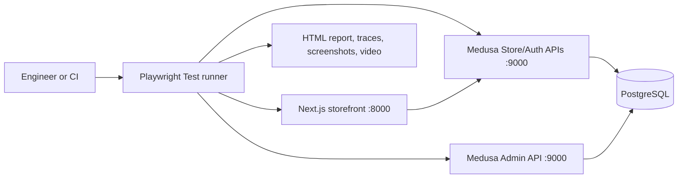
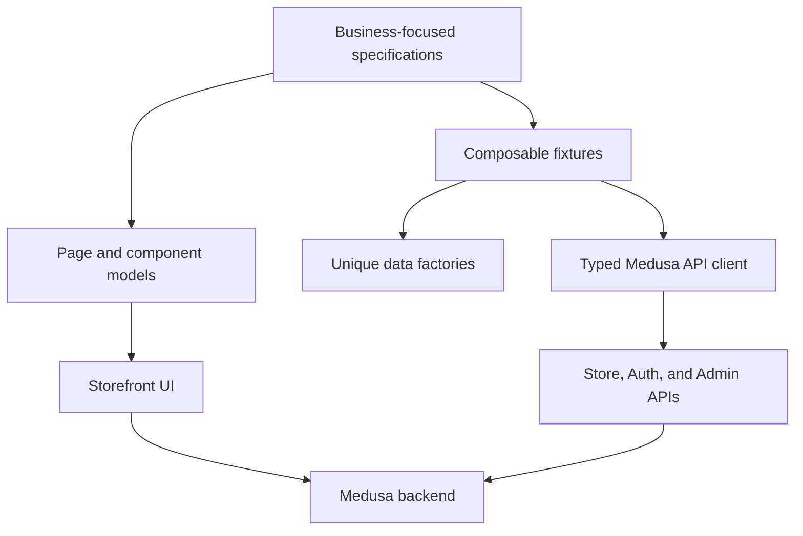
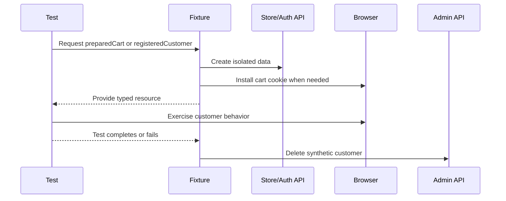

# Architecture

## System context

Playwright exercises customer behavior through the storefront and uses APIs only when setup or verification is not the behavior under test. Admin access is limited to deleting synthetic customers.

## Automation layers

| Layer                   | Responsibility                                          |
| ----------------------- | ------------------------------------------------------- |
| `automation/tests`      | Business risk, assertions, tags, and suite organization |
| `automation/pages`      | Reusable interactions with meaningful pages             |
| `automation/components` | Shared UI components such as navigation                 |
| `automation/fixtures`   | On-demand setup, browser state, and teardown            |
| `automation/factories`  | Unique synthetic customers and prepared carts           |
| `automation/api`        | Typed Store, Auth, and Admin operations                 |
| `automation/config`     | Environment resolution without hardcoded secrets        |

## Test-data lifecycle

Carts and completed orders are intentionally not deleted individually. CI gives each run a disposable PostgreSQL database; local environments can be periodically reset.

## Execution matrix

| Trigger      | Checks                                              |
| ------------ | --------------------------------------------------- |
| Pull request | Format, lint, TypeScript, API tests, Chromium smoke |
| Main push    | Full Chromium regression plus Firefox/WebKit smoke  |
| Nightly      | Full Chromium regression plus Firefox/WebKit smoke  |
| Local        | Full, tagged, focused, headed, or UI mode           |

CI provisions PostgreSQL, runs migrations and stable seed data, lets Medusa generate ephemeral API keys, masks them, starts both applications, and uploads evidence.
