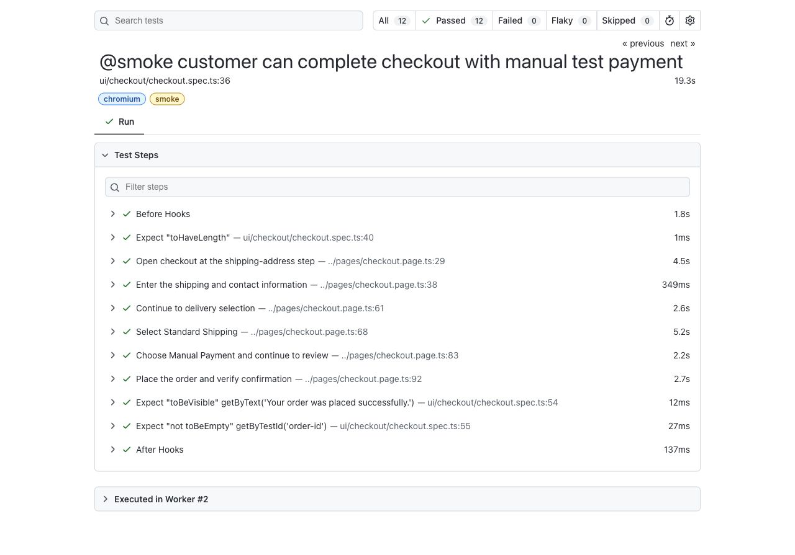

# Report evidence

## Cross-browser smoke result

The generated report shows 12 passing executions: four critical scenarios across Chromium, Firefox, and WebKit.


## Business-readable checkout steps

The checkout result exposes meaningful actions rather than a flat sequence of locator calls.



Generate and open the latest local report with:

```bash
npm test
npx playwright show-report automation/playwright-report
```
